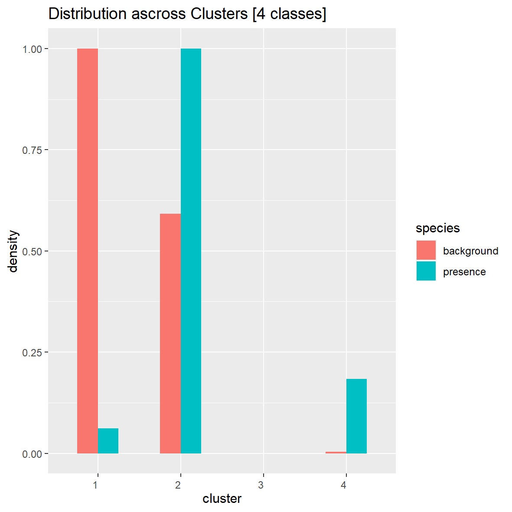
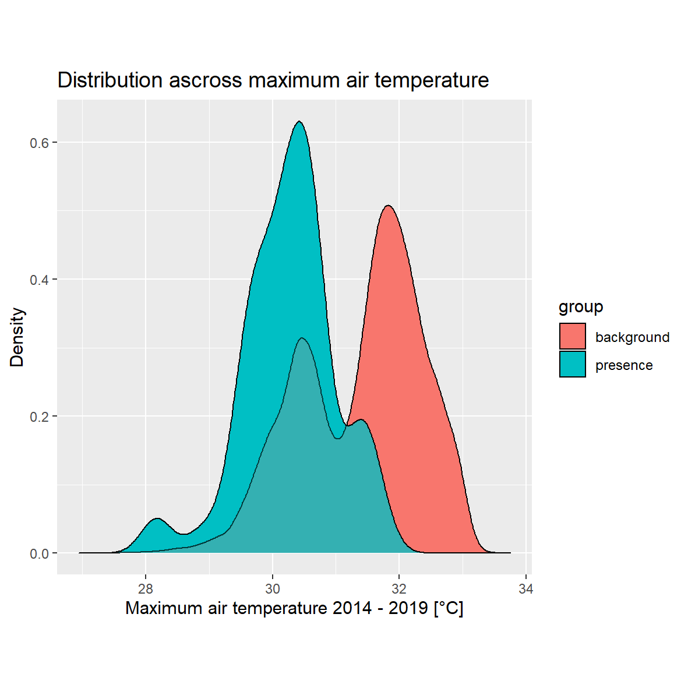
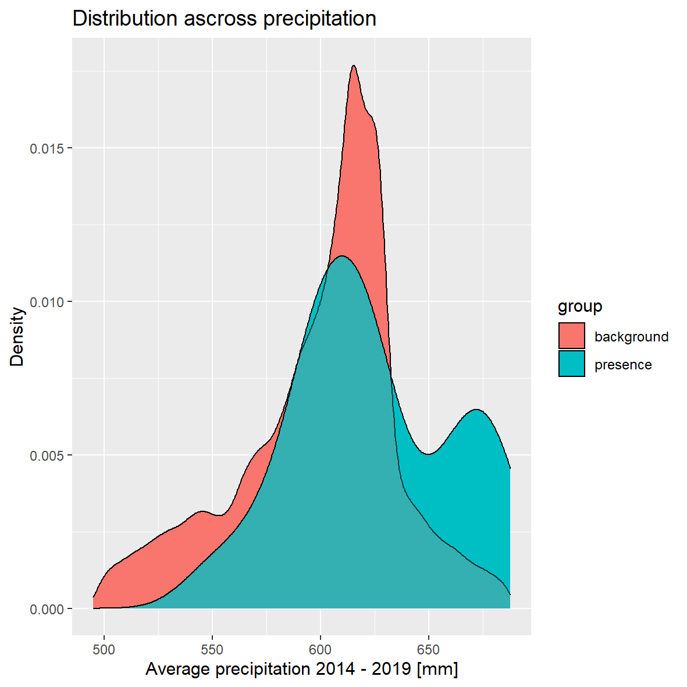

## Data input
I assume that coordinates 14-4-23.53 == 14-04-23.53  
locality Pustá Rybná typo in latitude? 16 vs 15

## Environmental variables

* "PotentialTotalSolarRadiat094",
* "elevation_10m094",
* TPI - "TopographicPositionIndex50_500m094",
* Tmin - "Q005AirTemp_f14t19",                 
* Tmax - "Q095AirTemp_f14t19",
* Precip - "MeanPrecipitation_f14t19",

## Cluster analysis
Based on six envi variables. K-mean clustering into 4 classes.  

Table shows the mean values for clusters. Std.Dev shows the deviation within cluster.  

| Cluster | Std.Dev. | TPI   | Tmin  | Tmax  | Precipit | elevation | Solar   |
|---------|----------|-------|-------|-------|----------|-----------|---------|
| 1       | 1.702612 | 0.22  | -8.89 | 32.15 | 612.73   | 479.90    | 1402.96 |
| 2       | 1.825904 | 0.41  | -8.90 | 30.30 | 614.26   | 623.86    | 1424.74 |
| 3       | 1.797563 | 0.32  | -8.90 | 31.84 | 541.01   | 506.59    | 1422.36 |
| 4       | 2.21709  | -1.27 | -9.92 | 31.16 | 603.07   | 528.47    | 1432.90 |

  
<th></th>
  
  
<th></th>

## Distribution in environamntal space
I generated 1e5 random points in study area and extracted envi conditions 
on the place. This random points sample background  envi condition in 
study area. I extracted envi variables also with presence points and 
thus we can compare background with presence density.
<table>
 <tr>
    <th></th>
    <th></th>
  </tr>
  <tr>
    <th></th>
    <th></th>
  </tr>
<table/>
