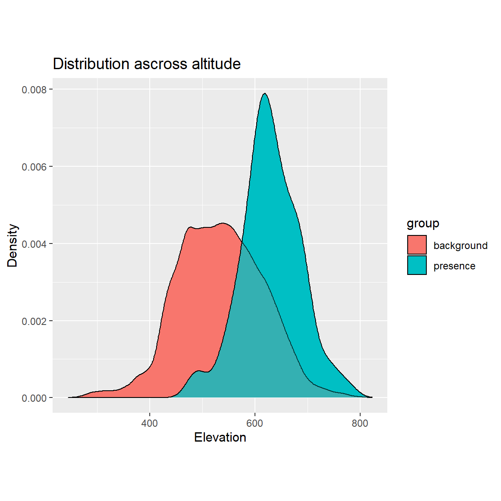

## Data input
I assume that coordinates 14-4-23.53 == 14-04-23.53  
locality Pustá Rybná typo in latitude? 16 vs 15

## Environmental variables

* "PotentialTotalSolarRadiat094",
* "elevation_10m094",
* "TopographicPositionIndex50_500m094",
* "Q005AirTemp_f14t19",                 
* "Q095AirTemp_f14t19",
* "MeanPrecipitation_f14t19",

## Cluster analysis
Based on six envi variables. K-mean clustering into 4 classes.  

<th></th>

## Distribution in environamntal space
I generated 1e5 random points in study area and extracted envi conditions 
on the place. This random points sample background  envi condition in 
study area. I extracted envi variables also with presence points and 
thus we can compare background with presence density.
<table>
 <tr>
    <th></th>
    <th></th>
  </tr>
  <tr>
    <th></th>
    <th></th>
  </tr>
<table/>
